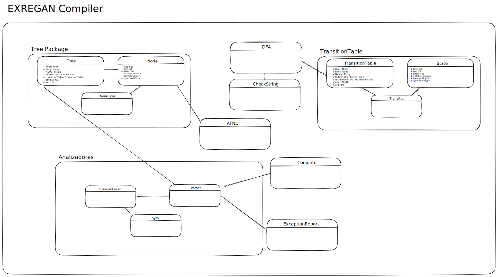

# **Proyecto EXREGAN**
### Universidad de San Carlos de Guatemala
### Facultad de Ingeniería
### Escuela de Ciencias y Sistemas
### Organización de Lenguajes y Compiladores 1
### Sección C

## Descripción del proyecto
El proyecto EXREGAN es un programa que permite analizar expresiones regulares y generar un autómata finito determinista (DFA, por sus siglas en inglés) a partir de ellas. El programa lee un archivo de entrada que contiene una lista de expresiones regulares y genera un archivo de salida que contiene la tabla de transiciones del DFA de cada expresión regular.
Además es capaz de analizar cadenas, y determinar si pertenecen o no a la expresión regular.

## Diagrama de clases

## Paquete Controller
En este paquete se encuentran las clases que se encargan de la lógica del programa, es decir, se encargan de la lectura de los archivos de entrada, la creación de los objetos necesarios para la creación del árbol de análisis sintáctico y la generación del archivo de salida.

# Clase Tree
La clase Tree representa un árbol de análisis sintáctico de una expresión regular. Esta clase se encuentra en el paquete `com.daniel.controller.Tree.`

## Atributos
- Root: un nodo raíz que indica el inicio del árbol.
- body: un nodo que representa la expresión regular.
- NameRegex: una cadena que indica el nombre de la expresión regular.
- followTable: una tabla que almacena los follow de cada nodo del árbol.
- transitionTable: una tabla de transiciones que representa el DFA de la expresión regular.
afnd: un AFND que representa el árbol de expresiones regular en notación de Thompson.
- afd: un DFA que representa la expresión regular.
## Constructor
- Tree(Node body, String nameRegex, int operatorNodeCounter, int nodeCounter): construye un objeto Tree a partir del nodo que representa la expresión regular, el nombre de la expresión regular, el contador de nodos de operador y el contador de nodos.

## Métodos
- initializeTransitionTable(): inicializa la tabla de transiciones.
- calculateFollow(Node root): calcula el follow de cada nodo del árbol.
- calculateTreeAttr(Node root): calcula los atributos de cada nodo del árbol.
- calculateDFA(): calcula el DFA de la expresión regular.
makeThompson(Node node): convierte el árbol de expresiones regulares en notación de Thompson en un AFND.
- findNode(Node root, int number): busca un nodo con el número especificado en el árbol.

`initializeTransitionTable()`
Este método inicializa la tabla de transiciones. Primero crea un nuevo estado inicial y le agrega los follows del nodo raíz. Luego crea una nueva tabla de transiciones con el estado inicial y la tabla de follow.

`calculateFollow(Node root)`
Este método calcula el follow de cada nodo del árbol. Si el nodo es nulo, el método se detiene. Si el nodo es un nodo de repetición o un nodo AND, se calcula el follow de los nodos de la izquierda y de la derecha. Si el nodo es un nodo de opción, se calcula el follow del nodo de la izquierda. Si el nodo es un nodo de aceptación, se agrega el nodo a la tabla de follow.

`calculateTreeAttr(Node root)`
Este método calcula los atributos de cada nodo del árbol. Si el nodo es nulo, el método se detiene. Si el nodo es un nodo de repetición o un nodo de opción, se calcula si el nodo es nullable, se calcula el first y el last del nodo de la izquierda y se copian al nodo actual. Si el nodo es un nodo **AND**, se calcula si el nodo es nullable, se calcula el first y el last de los nodos de la izquierda y de la derecha y se copian al nodo actual. Si el nodo es un nodo **OR**, se calcula si el nodo es nullable, se calcula el first y el last de los nodos de la izquierda y de la derecha y se copian al nodo actual. Si el nodo es un nodo de hoja o un nodo de aceptación, se asignan valores apropiados a los atributos.

`calculateDFA()`
Este método calcula el DFA de la expresión regular.

# Clase Node
La clase Node representa un nodo en un árbol de sintaxis abstracta (AST) generado a partir de una expresión regular.

## Atributos
- first: un conjunto de enteros que representan los índices de las posiciones de inicio de las subcadenas que pueden ser derivadas a partir del nodo actual.
- last: un conjunto de enteros que representan los índices de las posiciones de fin de las subcadenas que pueden ser derivadas a partir del nodo actual.
- follow: un conjunto de enteros que representa los índices de las posiciones de inicio de las subcadenas que pueden derivarse a partir del nodo actual cuando se encuentra en una concatenación o en una operación de cierre.
- nullable: un valor booleano que indica si el nodo puede derivar una cadena vacía o no.
- lexeme: un objeto que representa el símbolo de la expresión regular que este nodo representa.
- type: un objeto que representa el tipo de nodo en el árbol de sintaxis abstracta.
- number: un entero que representa el número de nodo en el árbol de sintaxis abstracta.
- left: el hijo izquierdo del nodo en el árbol de sintaxis abstracta.
- right: el hijo derecho del nodo en el árbol de sintaxis abstracta.
- startState: un objeto que representa el estado inicial de un autómata finito determinista (DFA) generado a partir del nodo actual.
- finalState: un objeto que representa el estado final de un DFA generado a partir del nodo actual.
## Métodos
`Node`(lexeme, type, number): constructor que crea un nodo con el símbolo lexeme, el tipo type y el número number.

`Node`(lexeme, type, number, left, right): constructor que crea un nodo con el símbolo lexeme, el tipo type, el número number, y los hijos izquierdo y derecho left y right.

`Node`(lexeme, type, number, left): constructor que crea un nodo con el símbolo lexeme, el tipo type, el número number y el hijo izquierdo left.

- `toString()`: devuelve una representación en cadena del símbolo lexeme del nodo.
- `getFirstPosString()`: devuelve una representación en cadena del conjunto first.
- `getLastPosString()`: devuelve una representación en cadena del conjunto last.
- `getFollowPosString()`: devuelve una representación en cadena del conjunto follow.
- `getNumber()`: devuelve el número del nodo.

# Clase TransitionTable
La clase TransitionTable es responsable de construir una tabla de transiciones para un autómata finito determinista (DFA, por sus siglas en inglés) a partir de una tabla de follow (FollowTable) y un estado inicial (State). La tabla de transiciones es una estructura de datos que describe cómo un autómata se mueve de un estado a otro en función de los símbolos de entrada.

La tabla de transiciones se construye mediante el método calculateTransitions(State state), el cual calcula todas las transiciones posibles a partir de un estado dado y las agrega a la tabla de transiciones (transitions). Para cada transición, se crea un nuevo estado si aún no existe en la tabla de estados (states), o se utiliza un estado existente si ya se ha creado anteriormente.

La clase también tiene varios métodos de utilidad, como verifyIfStateIsAccepting(), que determina si un estado es de aceptación (es decir, si hay un nodo aceptador en su lista de follows), y getTransitionsFromState(State state), que devuelve un conjunto de todas las transiciones que salen de un estado dado.

## Atributos
- initialState: El estado inicial del autómata.
- transitions: Conjunto de transiciones de la tabla de transiciones.
- states: Conjunto de estados de la tabla de transiciones.
- name: Nombre de la tabla de transiciones (opcional).
- followTable: Tabla de follow del autómata.
## Constructor
- TransitionTable(State initialState, FollowTable followTable): Crea una nueva tabla de transiciones a partir de un estado inicial y una tabla de follow.
## Métodos
- calculateTransitions(State state): Calcula todas las transiciones posibles a partir de un estado dado y las agrega a la tabla de transiciones.
- verifyIfTransitionExist(Transition transition): Verifica si una transición ya existe en la tabla de transiciones.
- verifyIfStateIsAccepting(): Determina si un estado es de aceptación.
- getStateByFollows(Set<Integer> follows): Devuelve un estado de la tabla de estados a partir de un conjunto de follows.
- getTransitionsFromState(State state): Devuelve un conjunto de todas las transiciones que salen de un estado dado.
- getNameRegex(): Devuelve el nombre de la tabla de transiciones.
- getLexemes(): Devuelve un conjunto de todos los lexemas de la tabla de transiciones.
- verifyIfStateExist(Set<Integer> follows): Verifica si un estado ya existe en la tabla de estados a partir de un conjunto de follows.
- getFollowsOfLexemeAvailable(int numberOfNode, Set<Integer> availableFollows): Devuelve un conjunto de follows a partir del número de un nodo de la tabla de follow y un conjunto de follows disponibles.

# Clase FollowTable
La clase FollowTable se encuentra en el paquete com.daniel.controller.FollowTable. Esta clase es responsable de almacenar y gestionar una tabla de nodos Node que se utilizan para construir un árbol.

## Constructores
La clase FollowTable tiene un constructor público sin argumentos. Este constructor crea un objeto Comparator que se utiliza para ordenar los nodos en función de su número y luego crea un conjunto (TreeSet) vacío de nodos Node. Este conjunto vacío se almacena en el atributo tableRows.

## Métodos
La clase FollowTable tiene tres métodos públicos:

- addTableRow(Node node): este método agrega un nodo Node al conjunto tableRows.

- getTableRows(): este método devuelve todo el conjunto tableRows de nodos Node.

- getNode(int number): este método busca en el conjunto tableRows un nodo Node con el número especificado y devuelve ese nodo. Si no se encuentra el nodo, se devuelve null.

La clase FollowTable es utilizada en conjunto con otras clases para construir y gestionar un árbol. Los métodos addTableRow y getNode son particularmente útiles para agregar y buscar nodos en la tabla.

# Clase DFA
La clase DFA representa un Autómata Finito Determinista y se encuentra en el paquete com.daniel.controller.DFA.

## Atributos:

- initialState (tipo State) representa el estado inicial del autómata.
- states (tipo Set<State>) representa el conjunto de estados del autómata.
- finalStates (tipo Set<State>) representa el conjunto de estados finales o de aceptación del autómata.
- transitionTable (tipo TransitionTable) representa la tabla de transiciones del autómata.
## Métodos:

- `calculateFinalStates()`: método que calcula los estados finales del autómata y los almacena en el atributo finalStates.
- `getName()`: método que devuelve el nombre de la tabla de transiciones del autómata.
- `accept(String input)`: método que determina si una cadena de entrada es aceptada por el autómata. Recibe como parámetro una cadena de caracteres input y devuelve un valor booleano (true si la cadena es aceptada, false en caso contrario).

# Clase AFND
La clase AFND representa un autómata finito no determinista (AFND). La documentación a continuación describe los métodos y atributos de la clase.

## Atributos
- states: una lista de los estados que componen el AFND.
- alphabet: un conjunto de símbolos que componen el alfabeto del AFND.
- transitions: una lista de transiciones que conectan los estados del AFND.
- stateCount: un contador para mantener un registro del número total de estados.
- finalState: el estado final del AFND.
- initialState: el estado inicial del AFND.
- EPSILON: una constante que representa el símbolo epsilon.
- name: una cadena de texto que representa el nombre del AFND.
## Métodos
- AFND(): el constructor de la clase. Inicializa las listas states y transitions.
- addAllStates(ArrayList<State> states): agrega todos los estados de una lista de estados states a la lista states del AFND.
- addState(State s): agrega un estado s a la lista states del AFND y actualiza su número con el contador stateCount.
- addState(): agrega un nuevo estado a la lista states del AFND y actualiza su número con el contador stateCount.
- addInitialState(): agrega un nuevo estado inicial al AFND y devuelve el estado agregado.
- addFinalState(): agrega un nuevo estado final al AFND y devuelve el estado agregado.
- concat(AFND left, AFND right): concatena dos AFND, left y right, y actualiza el AFND actual.
- union(AFND left, AFND right): une dos AFND, left y right, y actualiza el AFND actual.
- nodei(Node token): crea un nuevo AFND con un nodo y lo actualiza al AFND actual.
- plus(AFND ndfa): crea un nuevo AFND que representa la operación + entre el AFND actual y ndfa.
- kleene(AFND ndfa): crea un nuevo AFND que representa la operación * entre el AFND actual y ndfa.
- optional(AFND ndfa): crea un nuevo AFND que representa la operación ? entre el AFND actual y ndfa.
- insertTransition(State currentState, String symbol, State nextState): agrega una nueva transición con el estado actual, el símbolo y el estado siguiente a la lista transitions.
- insertState(int number): agrega un nuevo estado con el número especificado a la lista states y devuelve el estado agregado.
