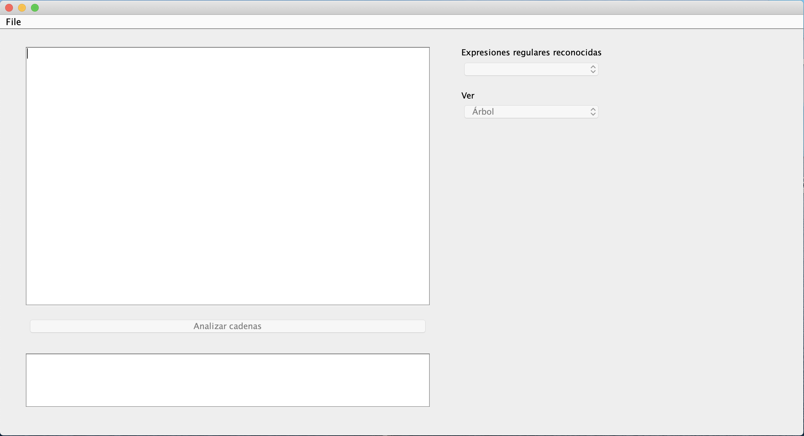
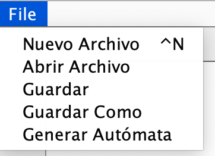
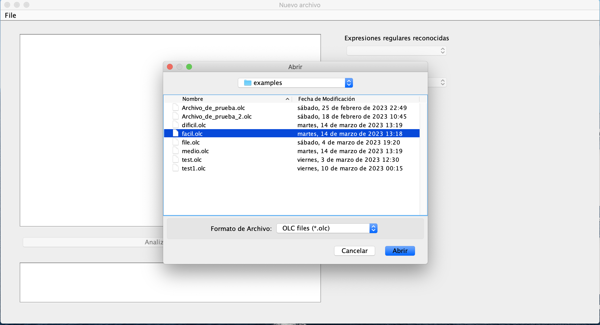
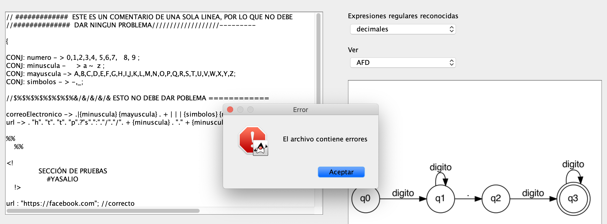
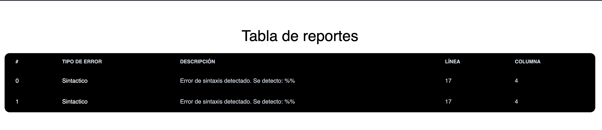
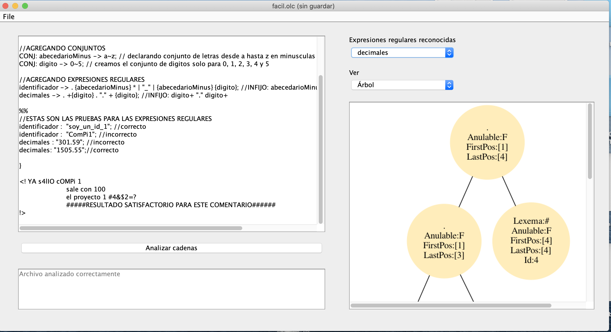
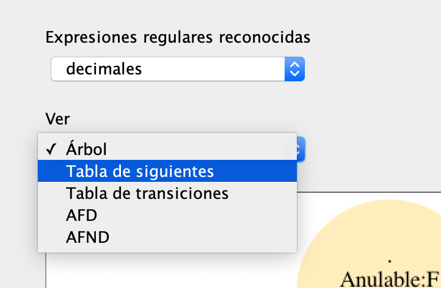
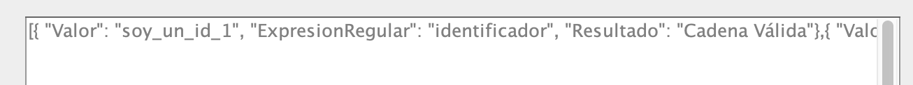

# Compilador Exregan

## Descripción del proyecto

Exregan es un compilador capaz de generar autómatas finitos deterministas (AFD) a partir de expresiones regulares. El proyecto se divide en dos partes: el compilador y el intérprete. El compilador es capaz de generar un AFD a partir de una expresión regular, mientras que el intérprete es capaz de ejecutar el AFD generado.
Mediante la definción de cadenas, el intérprete es capaz de reconocer si una cadena pertenece al lenguaje generado por la expresión regular.
Además permite la creación de *alias* para expresiones regulares, de forma que se pueda utilizar el alias en lugar de la expresión regular.

## Índice

1. [Definición de conjuntos](#definicion-de-conjuntos)
2. [Declaración de expresiones regulares](#declaracion-de-expresiones-regulares)
3. [Definción de cadenas para analizar](#definición-de-cadenas-para-analizar)
4. [Interfaz de usuario](#interfaz-de-usuario)

## Definicion de conjuntos
Con la palabra reservada `CONJ` se puede definir un conjunto de caracteres. Por ejemplo, el conjunto de caracteres que contiene los dígitos del 0 al 9 se define de la siguiente forma:
```
CONJ: digitos -> 0~9;
```
El conjunto de caracteres que contiene los dígitos del 0 al 9 y las letras de la A a la Z se define de la siguiente forma:
```
CONJ: digitos -> 0~9;
CONJ: letrasMayus -> A~Z;
CONJ: letrasMinus -> a~z;
```

Luego de la definción de conjuntos, se pueden utilizar en la definición de expresiones regulares. Es importante dividir esa sección mediante el uso de doble signo de porcentaje de la siguiente forma:
```
CONJ: digitos -> 0~9;
CONJ: letrasMayus -> A~Z;
CONJ: letrasMinus -> a~z;

%%
```

## Declaracion de expresiones regulares
Se le puede asignar cualquier identificador a una expresión regular. Por ejemplo, la expresión regular que reconoce los dígitos del 0 al 9 se define de la siguiente forma:
```
identificador -> . {abecedarioMinus} * | "_" | {abecedarioMinus} {digito};
```
Es importante escribir la expresión regular en notación poloca, también conocida como notación prefija, de forma que se pueda generar el AFD correspondiente.

## Definición de cadenas para analizar
Para definir las cadenas, es importante utilizar el identificador de la expresión regular que se desea reconocer. Por ejemplo, para reconocer los dígitos del 0 al 9, se utiliza el identificador `digito`:
```
// Cadena que contiene los dígitos del 0 al 9
identificador -> . {abecedarioMinus} * | "_" | {abecedarioMinus} {digito};

// Cadena
identificador :  "soy_un_id_1";
```

## Interfaz de usuario
El compilador cuenta con una interfaz de usuario que permite la ejecución de los comandos de forma interactiva. Para ejecutar el compilador, se debe ejecutar el archivo `[namefile].olc`:


### Opciones
La interfaz permite la ejecución de los siguientes comandos:
- `Nuevo Archivo`: Muestra la ayuda del compilador.
- `Abrir Archivo`: Sale del compilador.
- `Guardar Archivo`: Guarda el archivo actual.
- `Guardar Archivo Como`: Guarda el archivo actual con un nuevo nombre.
- `Generar autómata`: Ejecuta el archivo actual.



### Ejecución de un archivo
Para ejecutar un archivo, se debe utilizar el comando `Generar autómata`:


### Ejecución de un archivo con errores
Si el archivo contiene errores, se mostrará un mensaje de error:


Seguido de un reporte en formato HTML con tabla de errores


### Ejecución del archivo para generar el AFD
Si el archivo no contiene errores, se mostrará un mensaje de éxito:


En el selector de expresiones regulares, se mostrarán las expresiones regulares definidas en el archivo junto con sus atributos:


### Analizar cadenas

Se deberá presionar el botón `Analizar cadena` para analizar la cadena ingresada:


Luego de presionar el botón, se mostrará un mensaje de éxito y se mostrará en la consola el resultado de las cadenas junto con un archivo en formato json.


